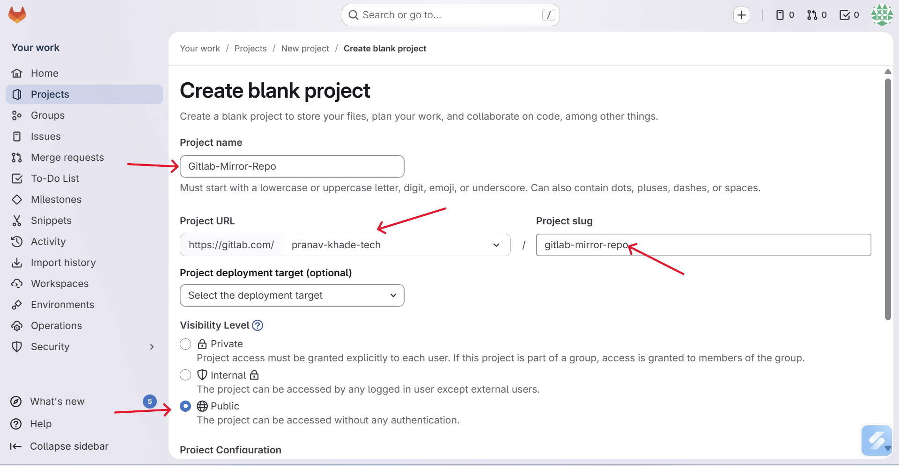
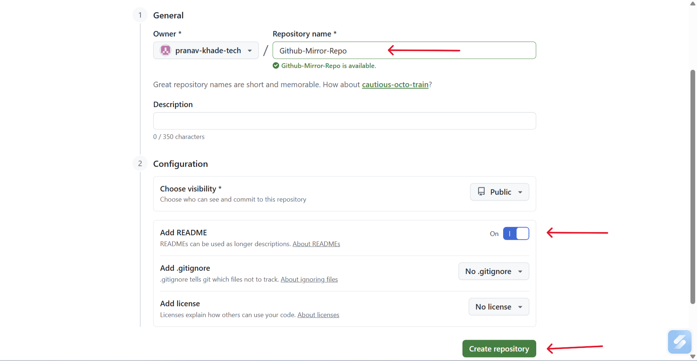
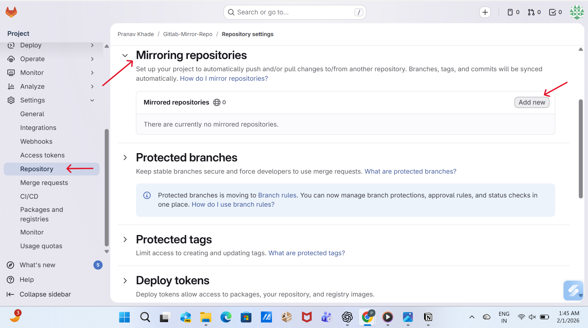
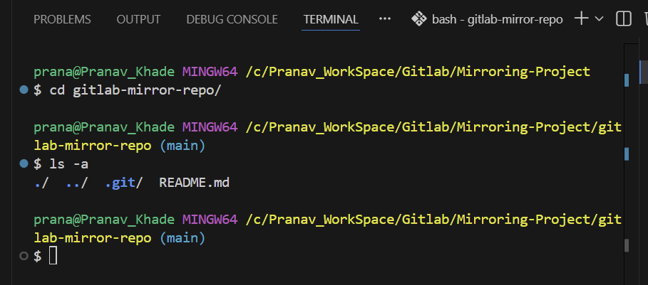
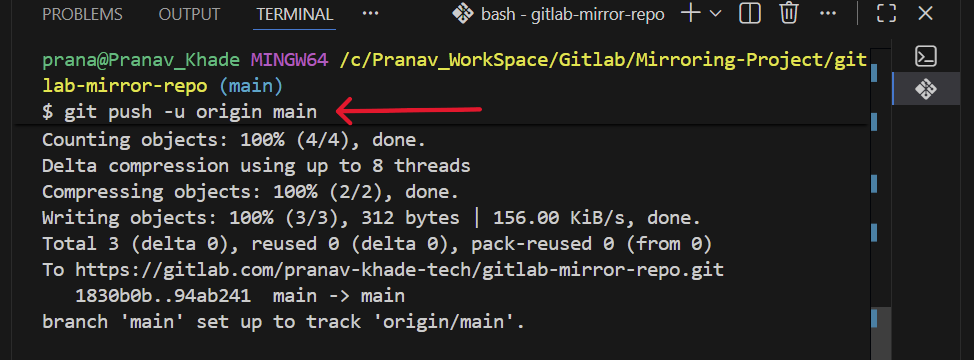
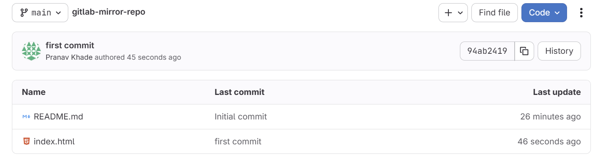

# Mirroring Of Repository From Local Machine --GitLab and GitHub

## Introduction

Repository mirroring is a technique used to keep multiple repositories synchronized automatically. In this project, a repository is maintained on GitLab as the main source, and GitHub is configured as a mirror repository. Any commit pushed from the local machine to the GitLab repository is automatically mirrored to the GitHub repository without requiring a separate push command. This approach helps in backup, platform availability, and collaboration across different Git platforms.

### Architecture Diagram


## Tools and Platforms Used

* Local Machine (Windows)
* Git Bash
* VS Code
* GitHub
* GitLab

---

## Step-by-Step Mirroring Workflow

### Step 1 : Create Repository on GitLab

1. Login to GitLab
2. Click New Project / Repository
3. Enter repository name
4. Create repository




### Step 2 : Create Repository on GitHub

1. Login to GitHub
2. Click New Repository
3. Enter repository name
4. Create repository




---


---
### Step 3 : Configure Repository Mirroring in GitLab (HTTPS URL)

1. Open your GitLab repository

2. Go to Settings → Repository

3. Scoll to Mirroring repositories

4. Select add new

5. Paste the GitHub repository HTTPS URL
6. Save the mirror configuration


### Step 4 : Create GitHub Personal Access Token
1. Login to GitHub
2. Go to Settings → Developer settings
3. Open Personal access tokens
4. Select Generate new token (Classic)
5. Give a token name
6. Set token expiration (limit days as required)
7. Set token visibility as private
8. Select all required permissions (check all boxes)
9. Generate the token, copy it, and paste this token into the GitLab repository mirroring authentication section


### Step 5 : Clone One Repository to Local Machine

You can clone either GitHub or GitLab repository

```bash
git clone https://gitlab.com/username/repo-name.git
cd repo-name
```


* Right-click inside the folder, click Show more options, then select Open Git Bash here to open Git Bash in this directory


---

### Step 6 : Open Project in VS Code

```bash
code . ; exit
```

.png)

---

### Step 7 : Create or Modify Files Locally
Examples:
* index.html
* README.md

##### Stage and Commit Changes
git status
git add .
git commit -m "Commit for mirroring to GitHub and GitLab"

### Step 8 : Push File into Gitlab and Github 

```bash
git push -u origin main

```



---
\
### Step 9 : See the Result File See Inside the GitLab and Github Repository




## Summary
This project shows how a single project maintained on a local machine can be kept in sync across GitLab and GitHub. All code updates are committed locally and pushed to GitLab, which then automatically mirrors the same changes to GitHub. This approach helps maintain identical code on multiple platforms, improves reliability through backup, and follows common Git and DevOps working practices used in real projects.
